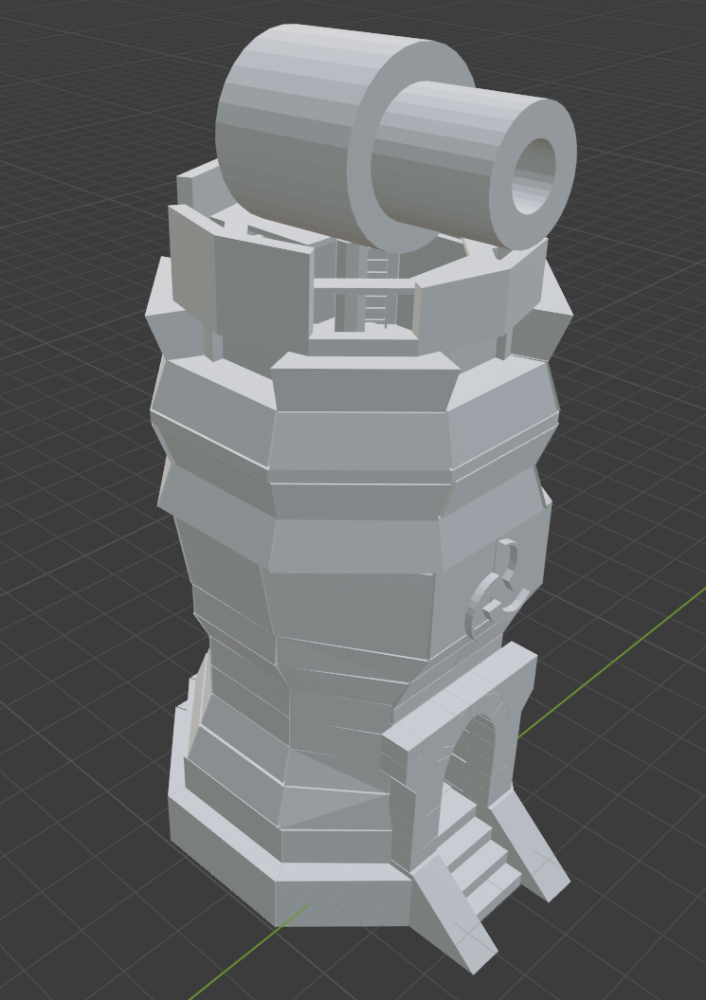

# 3D Modelling Portfolio

This repository displays some of the 3D models that I have produced for different projects.

## Jib Crane Structural Simulation

The jib crane model was developed in SolidWorks to conduct an engineering study on an existing jib crane that sought to extend the arm by one metre. 
By mimicking the original design specifications of the jib crane, the model could simulate proposed modifications to the jib crane's components and undertake subsequent structural analysis and load rating.

## Home Office Visualisation

This animation displays an example of a previous visualisation project. The model was created in SketchUp based on source photographs of an existing home office, then imported into Unity. 
This provided a virtual design studio to trial modifications to the dimensions, layout and features of the office.

## Crane Perspective
A gif displaying the jib crane arm rotation alongside the office.

## Tower Defence Tower
A fantasy inspired tower created in Blender, designed for a tower defence game made with Unity.

