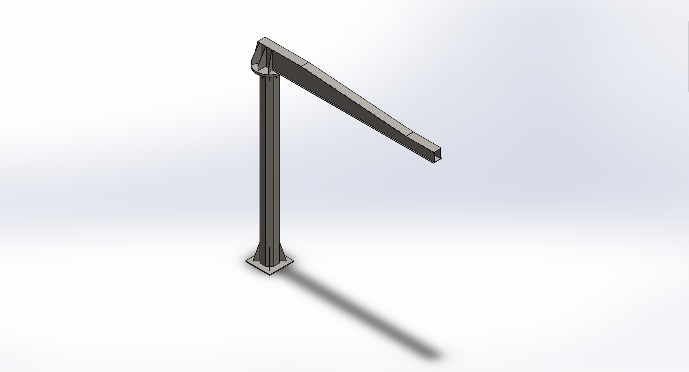
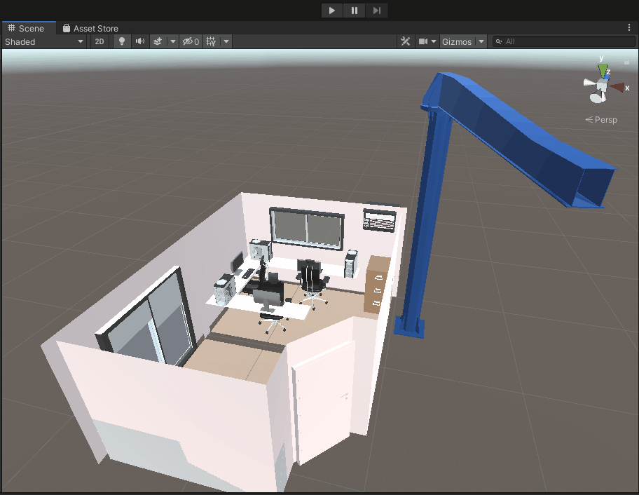

# 3D Modelling

This repository displays some of the 3D models I have produced.

## Jib Crane Structural Simulation

The below model was developed using SolidWorks to conduct an engineering study on an existing jib crane that sought to extend the arm by one metre. 
By mimicking the original design specifications of the jib crane, the model enabled the ability to simulate proposed modifications to the crane components and undertake structural analysis and load rating.

## Home Office Visualisation

The below animation displays an example of a previous visualisation project. The model was created in SketchUp based on source photographs of an existing home office, then imported into Unity. 
This provided a virtual design studio to trial modifications to the dimensions, layout and features of the office.

## Crane Perspective
Below is a gif displaying the jib crane arm rotation alongside the office.

